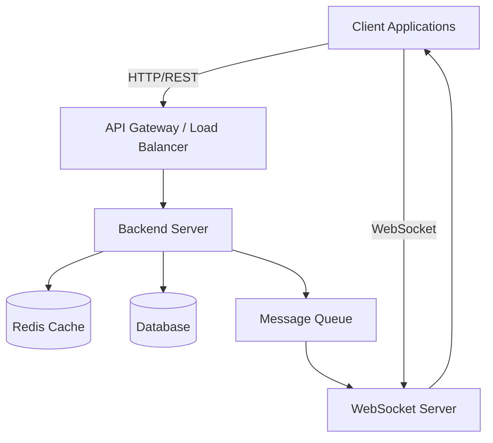
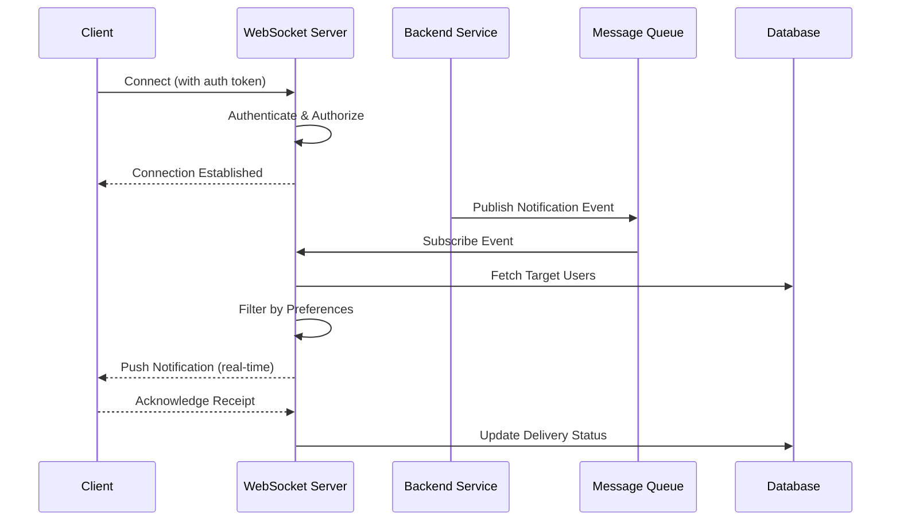
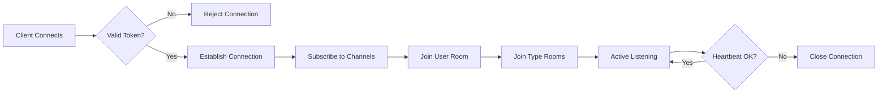
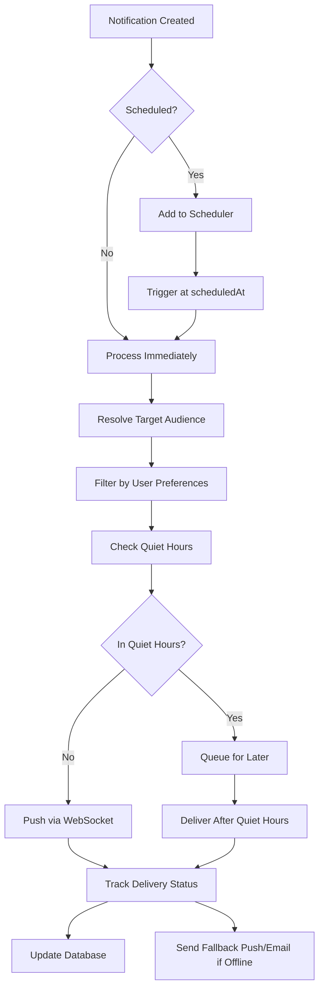
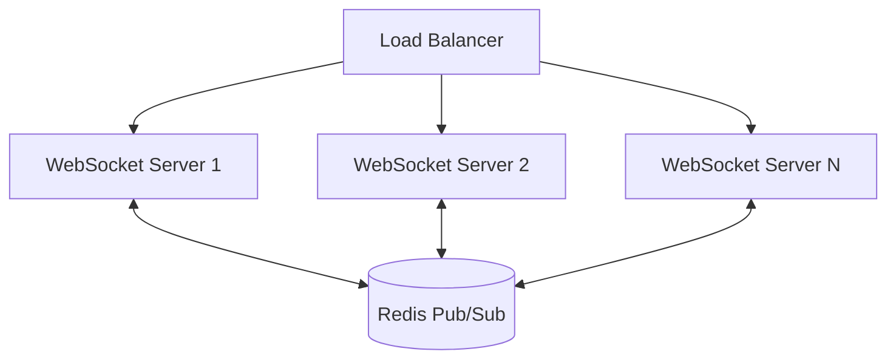
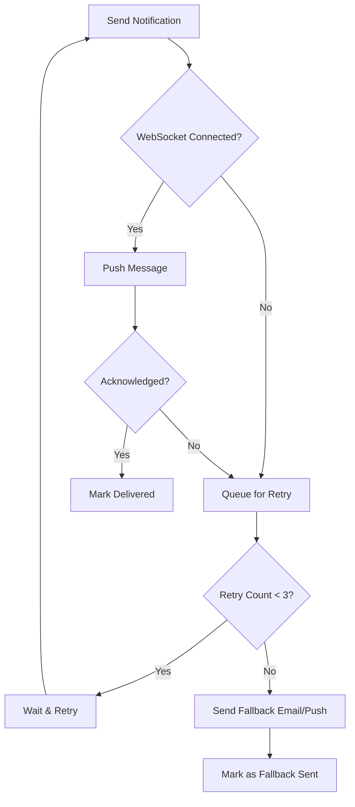

# Notification System Design

## Overview
This document outlines the architecture and design of the notification system evaluation project. The system is built as a TypeScript monorepo with a clear separation of concerns.

## Project Structure

```
Drive/
├── logging_middleware/          # Reusable logging package
├── notification_app_be/         # Express backend
├── notification_app_fe/         # Next.js frontend
├── notification_system_design.md
└── .gitignore
```

## Architecture Components

### 1. Logging Middleware (`logging_middleware/`)
- **Purpose**: Reusable logging middleware package
- **Technology**: TypeScript, Express
- **Scope**: Centralized logging functionality for use across backend and other services
- **Package**: `@notification/logging-middleware`

### 2. Backend (`notification_app_be/`)
- **Purpose**: API server and business logic
- **Technology**: Express.js, TypeScript
- **Port**: 3001 (configurable via .env)
- **Dependencies**: logging_middleware, cors, dotenv
- **Package**: `@notification/app-backend`

### 3. Frontend (`notification_app_fe/`)
- **Purpose**: User interface
- **Technology**: Next.js 14 (App Router), React 18, TypeScript
- **Port**: 3000 (default Next.js)
- **Features**: Server-side rendering, static optimization, built-in API routes
- **Package**: `@notification/app-frontend`

## Technology Stack

### Core
- **Language**: TypeScript 5.3
- **Runtime**: Node.js 20+
- **Package Manager**: npm (with workspaces)

### Backend
- **Framework**: Express.js 4.18
- **Middleware**: CORS, logging middleware
- **Configuration**: dotenv

### Frontend
- **Framework**: Next.js 14 (App Router)
- **UI Library**: React 18
- **HTTP Client**: Axios
- **Styling**: (To be implemented)

### Development Tools
- **Linting**: ESLint 8
- **Formatting**: Prettier 3
- **Type Checking**: TypeScript compiler
- **Development Watch**: tsx (for backend), Next.js dev server (for frontend)
- **Concurrency**: Concurrently (for monorepo dev)

## Development Workflow

### Installation
```bash
npm install
```

### Development
```bash
npm run dev          # Runs both backend and frontend
```

### Building
```bash
npm run build        # Builds all workspaces
```

### Linting & Formatting
```bash
npm run lint         # Lint all workspaces
npm run format       # Format all files
npm run format:check # Check formatting without changes
```

## Configuration Files

### Root Level
- **package.json**: Monorepo configuration with workspaces
- **tsconfig.json**: Base TypeScript configuration (extended by each workspace)
- **.eslintrc.json**: ESLint rules (base, extended by each workspace)
- **.prettierrc.json**: Prettier formatting rules
- **.gitignore**: Git ignore patterns

### Per-Workspace
- **package.json**: Workspace-specific dependencies and scripts
- **tsconfig.json**: Extended from root, workspace-specific compiler options
- **.eslintrc.json**: Extended from root (with overrides if needed)
- **.env.example**: Environment variable template

## Environment Variables

### Backend (.env)
```
PORT=3001
NODE_ENV=development
LOG_LEVEL=debug
```

### Frontend (.env.local)
```
NEXT_PUBLIC_API_URL=http://localhost:3001/api
```

## Code Quality Standards

### TypeScript Strict Mode
- All files compiled with strict type checking
- Explicit return types required for functions
- Null/undefined checks enforced

### Linting Rules
- No unused variables (exception: prefixed with `_`)
- No explicit `any` types (warnings)
- Console usage limited to `warn` and `error`

### Formatting
- 2-space indentation
- Single quotes for strings
- Trailing commas (ES5 style)
- Line width: 100 characters
- LF line endings

## Monorepo Structure Benefits

1. **Code Reusability**: Logging middleware shared across projects
2. **Unified Tooling**: Single ESLint, Prettier, TypeScript configuration
3. **Simplified Dependencies**: Shared dev dependencies at root level
4. **Easy Development**: Single `npm install` and `npm run dev`
5. **Consistency**: Unified code style and standards

## Stage 1: Core Notification Platform

### 1.1 Notification Categories

The platform supports three primary notification types:

| Category | Description | Use Cases |
|----------|-------------|-----------|
| **Placement** | Campus recruitment and career opportunities | Job postings, interview schedules, placement drives |
| **Result** | Academic performance and outcomes | Exam results, grade cards, semester standings |
| **Event** | Campus activities and announcements | Workshops, seminars, cultural events, deadlines |

### 1.2 System Architecture



### 1.3 REST API Design

#### Base URL
```
https://api.campusdrive.com/v1
```

#### Authentication
All endpoints require Bearer token authentication:
```
Authorization: Bearer <token>
```

#### Common Headers
```
Content-Type: application/json
Accept: application/json
X-Request-ID: <uuid>
```

### 1.4 Endpoint Definitions

#### Notification Management

**1. Create Notification**
```
POST /notifications
```

**Request Schema:**
```typescript
{
  type: 'placement' | 'result' | 'event'
  title: string                      // Max 200 characters
  body: string                       // Max 2000 characters
  priority: 'low' | 'medium' | 'high' | 'critical'
  metadata?: {
    placement?: {
      company: string
      position: string
      deadline: string              // ISO 8601 date
      eligibility?: {
        minCGPA: number
        branches: string[]
        batch: number
      }
    }
    result?: {
      examName: string
      semester: number
      academicYear: string          // Format: "2024-2025"
      resultUrl?: string
    }
    event?: {
      eventName: string
      location: string
      startDate: string             // ISO 8601 datetime
      endDate: string               // ISO 8601 datetime
      registrationDeadline?: string // ISO 8601 datetime
      maxParticipants?: number
    }
  }
  targetAudience: {
    all: boolean
    segments?: {
      branches?: string[]
      batches?: number[]
      roles?: string[]
    }
  }
  scheduledAt?: string              // ISO 8601 datetime (optional)
  expiresAt?: string                // ISO 8601 datetime (optional)
}
```

**Response Schema (201 Created):**
```typescript
{
  success: true
  data: {
    id: string                      // UUID
    type: 'placement' | 'result' | 'event'
    title: string
    body: string
    priority: 'low' | 'medium' | 'high' | 'critical'
    status: 'scheduled' | 'sent' | 'expired' | 'draft'
    metadata: object                // Same as request metadata
    targetAudience: object          // Same as request targetAudience
    scheduledAt: string | null
    expiresAt: string | null
    createdAt: string               // ISO 8601 datetime
    updatedAt: string               // ISO 8601 datetime
    createdBy: string               // User ID
  }
  timestamp: string                 // ISO 8601 datetime
}
```

---

**2. Get Notifications (List)**
```
GET /notifications
```

**Query Parameters:**
```
type?: 'placement' | 'result' | 'event'
priority?: 'low' | 'medium' | 'high' | 'critical'
status?: 'scheduled' | 'sent' | 'expired' | 'draft'
search?: string                     // Search in title and body
page?: number                       // Default: 1
limit?: number                      // Default: 20, Max: 100
sortBy?: 'createdAt' | 'scheduledAt' | 'priority'
sortOrder?: 'asc' | 'desc'          // Default: 'desc'
from?: string                       // ISO 8601 datetime
to?: string                         // ISO 8601 datetime
```

**Response Schema (200 OK):**
```typescript
{
  success: true
  data: {
    notifications: [
      {
        id: string
        type: 'placement' | 'result' | 'event'
        title: string
        body: string
        priority: 'low' | 'medium' | 'high' | 'critical'
        status: 'scheduled' | 'sent' | 'expired' | 'draft'
        metadata: object
        scheduledAt: string | null
        expiresAt: string | null
        createdAt: string
        updatedAt: string
      }
    ]
    pagination: {
      page: number
      limit: number
      total: number
      totalPages: number
      hasNext: boolean
      hasPrev: boolean
    }
  }
  timestamp: string
}
```

---

**3. Get Notification by ID**
```
GET /notifications/:id
```

**Response Schema (200 OK):**
```typescript
{
  success: true
  data: {
    id: string
    type: 'placement' | 'result' | 'event'
    title: string
    body: string
    priority: 'low' | 'medium' | 'high' | 'critical'
    status: 'scheduled' | 'sent' | 'expired' | 'draft'
    metadata: object
    targetAudience: object
    scheduledAt: string | null
    expiresAt: string | null
    createdAt: string
    updatedAt: string
    createdBy: string
    sentAt: string | null
    deliveryStats?: {
      total: number
      delivered: number
      read: number
      failed: number
    }
  }
  timestamp: string
}
```

---

**4. Update Notification**
```
PATCH /notifications/:id
```

**Request Schema:**
```typescript
{
  title?: string
  body?: string
  priority?: 'low' | 'medium' | 'high' | 'critical'
  metadata?: object
  targetAudience?: object
  scheduledAt?: string | null
  expiresAt?: string | null
}
```

**Response Schema (200 OK):**
```typescript
{
  success: true
  data: {                            // Same as GET /notifications/:id
    id: string
    type: string
    title: string
    body: string
    priority: string
    status: string
    metadata: object
    targetAudience: object
    scheduledAt: string | null
    expiresAt: string | null
    createdAt: string
    updatedAt: string
    createdBy: string
  }
  timestamp: string
}
```

---

**5. Delete Notification**
```
DELETE /notifications/:id
```

**Response Schema (200 OK):**
```typescript
{
  success: true
  message: 'Notification deleted successfully'
  timestamp: string
}
```

---

#### User Notification Preferences

**6. Get User Preferences**
```
GET /users/:userId/preferences
```

**Response Schema (200 OK):**
```typescript
{
  success: true
  data: {
    userId: string
    preferences: {
      placement: {
        enabled: boolean
        channels: ['push' | 'email' | 'sms' | 'in-app']
        priorityFilter: ('low' | 'medium' | 'high' | 'critical')[]
      }
      result: {
        enabled: boolean
        channels: ['push' | 'email' | 'sms' | 'in-app']
        priorityFilter: ('low' | 'medium' | 'high' | 'critical')[]
      }
      event: {
        enabled: boolean
        channels: ['push' | 'email' | 'sms' | 'in-app']
        priorityFilter: ('low' | 'medium' | 'high' | 'critical')[]
      }
      quietHours: {
        enabled: boolean
        start: string               // Format: "HH:MM" (24h)
        end: string                 // Format: "HH:MM" (24h)
      }
    }
    updatedAt: string
  }
  timestamp: string
}
```

---

**7. Update User Preferences**
```
PATCH /users/:userId/preferences
```

**Request Schema:**
```typescript
{
  preferences: {
    placement?: {
      enabled?: boolean
      channels?: ('push' | 'email' | 'sms' | 'in-app')[]
      priorityFilter?: ('low' | 'medium' | 'high' | 'critical')[]
    }
    result?: {
      enabled?: boolean
      channels?: ('push' | 'email' | 'sms' | 'in-app')[]
      priorityFilter?: ('low' | 'medium' | 'high' | 'critical')[]
    }
    event?: {
      enabled?: boolean
      channels?: ('push' | 'email' | 'sms' | 'in-app')[]
      priorityFilter?: ('low' | 'medium' | 'high' | 'critical')[]
    }
    quietHours?: {
      enabled?: boolean
      start?: string
      end?: string
    }
  }
}
```

**Response Schema (200 OK):**
```typescript
{
  success: true
  data: {                            // Same as GET preferences response
    userId: string
    preferences: object
    updatedAt: string
  }
  timestamp: string
}
```

---

#### User Notifications (Inbox)

**8. Get User Notifications**
```
GET /users/:userId/notifications
```

**Query Parameters:**
```
type?: 'placement' | 'result' | 'event'
read?: boolean
page?: number
limit?: number
sortBy?: 'createdAt' | 'priority'
sortOrder?: 'asc' | 'desc'
```

**Response Schema (200 OK):**
```typescript
{
  success: true
  data: {
    notifications: [
      {
        id: string
        notificationId: string      // Original notification ID
        type: 'placement' | 'result' | 'event'
        title: string
        body: string
        priority: 'low' | 'medium' | 'high' | 'critical'
        read: boolean
        readAt: string | null
        metadata: object
        createdAt: string
        expiresAt: string | null
      }
    ]
    unreadCount: number
    pagination: {
      page: number
      limit: number
      total: number
      totalPages: number
    }
  }
  timestamp: string
}
```

---

**9. Mark Notification as Read**
```
PATCH /users/:userId/notifications/:notificationId/read
```

**Response Schema (200 OK):**
```typescript
{
  success: true
  data: {
    id: string
    notificationId: string
    read: true
    readAt: string                  // ISO 8601 datetime
  }
  timestamp: string
}
```

---

**10. Mark All as Read**
```
POST /users/:userId/notifications/read-all
```

**Response Schema (200 OK):**
```typescript
{
  success: true
  message: 'All notifications marked as read'
  data: {
    markedCount: number
  }
  timestamp: string
}
```

### 1.5 Real-Time Notification Architecture

#### WebSocket Implementation



#### Connection Management



**WebSocket Channels:**
- `user:{userId}` - Personal notifications
- `type:placement` - Placement notifications
- `type:result` - Result notifications
- `type:event` - Event notifications
- `priority:critical` - Critical priority alerts

**WebSocket Message Format:**
```typescript
// Incoming from server
{
  event: 'notification:new'
  data: {
    id: string
    notificationId: string
    type: 'placement' | 'result' | 'event'
    title: string
    body: string
    priority: 'low' | 'medium' | 'high' | 'critical'
    metadata: object
    createdAt: string
  }
  timestamp: string
}

// Client acknowledgment
{
  event: 'notification:ack'
  data: {
    notificationId: string
    receivedAt: string
  }
}

// Heartbeat
{
  event: 'ping'
  data: {
    serverTime: string
  }
}

// Client pong
{
  event: 'pong'
  data: {
    clientTime: string
  }
}
```

#### Real-Time Delivery Flow



#### Scaling Strategy



**Key Components:**
- **Redis Pub/Sub**: Cross-server message broadcasting
- **Sticky Sessions**: Optional for connection affinity
- **Horizontal Scaling**: Add WebSocket servers as needed
- **Connection Draining**: Graceful shutdown support

#### Error Handling & Retry Logic



**Retry Configuration:**
- Max retries: 3
- Backoff strategy: Exponential (1s, 2s, 4s)
- Fallback channels: Email, SMS, Push notification
- Dead letter queue: Failed notifications stored for manual review

### 1.6 Data Models

#### Notification Entity
```typescript
interface Notification {
  id: string
  type: 'placement' | 'result' | 'event'
  title: string
  body: string
  priority: 'low' | 'medium' | 'high' | 'critical'
  status: 'draft' | 'scheduled' | 'sending' | 'sent' | 'expired' | 'cancelled'
  metadata: PlacementMetadata | ResultMetadata | EventMetadata
  targetAudience: TargetAudience
  scheduledAt: Date | null
  expiresAt: Date | null
  createdAt: Date
  updatedAt: Date
  createdBy: string
}
```

#### UserNotification Entity
```typescript
interface UserNotification {
  id: string
  userId: string
  notificationId: string
  read: boolean
  readAt: Date | null
  delivered: boolean
  deliveredAt: Date | null
  deliveryChannel: 'websocket' | 'email' | 'sms' | 'push'
  createdAt: Date
}
```

#### UserPreferences Entity
```typescript
interface UserPreferences {
  id: string
  userId: string
  preferences: NotificationPreferences
  createdAt: Date
  updatedAt: Date
}
```

### 1.7 API Response Standards

#### Success Response
```typescript
{
  success: true
  data: <T>                         // Response payload
  message?: string                  // Optional message
  timestamp: string                 // ISO 8601 datetime
}
```

#### Error Response
```typescript
{
  success: false
  error: {
    code: string                    // Error code (e.g., 'NOT_FOUND')
    message: string                 // Human-readable message
    details?: object                // Additional error details
  }
  timestamp: string
}
```

#### Common Error Codes
| Code | HTTP Status | Description |
|------|-------------|-------------|
| `VALIDATION_ERROR` | 400 | Invalid request payload |
| `UNAUTHORIZED` | 401 | Missing or invalid authentication |
| `FORBIDDEN` | 403 | Insufficient permissions |
| `NOT_FOUND` | 404 | Resource not found |
| `CONFLICT` | 409 | Resource conflict |
| `RATE_LIMIT_EXCEEDED` | 429 | Too many requests |
| `INTERNAL_ERROR` | 500 | Server error |

## Implementation Roadmap

> Features to be implemented after project skeleton completion

1. **Logging Middleware**
   - Request/response logging
   - Error logging
   - Performance metrics

2. **Backend API**
   - Notification endpoints
   - Database integration
   - Authentication/Authorization

3. **Frontend**
   - Notification display components
   - Real-time notification updates
   - User preferences UI

## Testing Strategy

> To be defined in implementation phase

- Unit tests
- Integration tests
- E2E tests with Playwright (tentative)

## Deployment

> To be defined in implementation phase

- Docker containerization
- CI/CD pipeline setup
- Cloud deployment options

## Next Steps

1. Implement logging middleware interfaces
2. Develop backend API endpoints
3. Create frontend components
4. Integrate frontend and backend
5. Add comprehensive testing
6. Deploy to cloud platform
